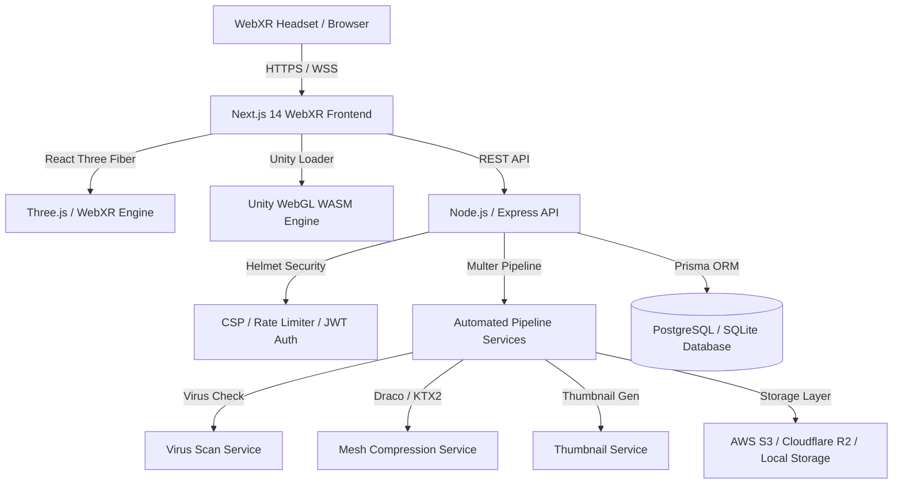

# System Architecture & WebXR Pipeline

## 🏗️ High-Level Platform Architecture

---

## 🥽 WebXR 90 FPS Rendering Pipeline

1. **Hardware Detection**: `navigator.xr.isSessionSupported('immersive-vr')` verifies 6DOF headset capabilities (Meta Quest 2/3, Vision Pro, HTC Vive).
2. **Session Initialization**: WebXR session requested with required features (`local-floor`, `hand-tracking`, `hit-test`).
3. **Asset Streaming**: High-poly GLB models optimized via Draco geometry decoders. Unity builds loaded via dynamic WebAssembly (.wasm) streaming.
4. **Rendering Loop**: Three.js WebXR render loop executing frustum culling, occlusion culling, low draw-call shading, and controller raycasting at 90 FPS.
